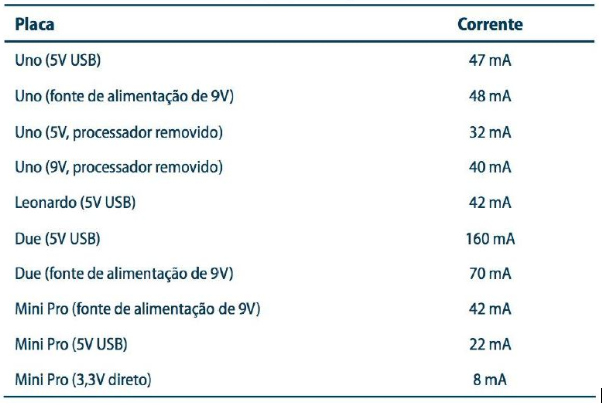
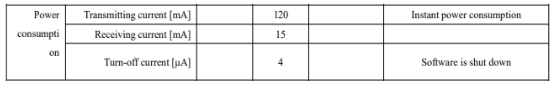

# Estudo de Baterias

## Tipos de bateria

Tem diversos tipos de bateria que podem ser usados com o arduino e microcontroladores, 
como por exemplo: baterias alcalinas de 9v, Li-ion, Lipo, pilhas, etc.  O problema de 
usar a bateria de 9v é que ela possui uma carga total muito baixa normalmente 120mAh, 
além de que por ser acima de 5 volts, seria necessário baixar a  tensão usando um 
regulador de tensão, que no arduino é um linear que consome uma boa parte energia, 
dissipando em calor.  
O mais adequado seria alimentar diretamente com 3.3 volts ou 5 volts, aí poderíamos 
alimentar com pilhas e fornecer 4,5 volts, e a depender da pilha pode ser uma boa solução.
Se partirmos para a alimentação por baterias de litio, seja as de Ion ou de polímero, o mais 
interessante seria usar as de 3.7 volts, que no máximo de carga chega a 4,2 volts e no mínimo 
cerca de 2.5 a 2.7 volts, aí seria necessário emitir um alerta quando fosse chegando a 3 volts,
porque apesar do arduino e outros microcontroladores poderem utilizar abaixo de 3 volts não é 
tão interessante, aí entra outra questão que é o monitoramento da bateria, mas será tratado 
mais a frente.
	
## Consumo do microcontrolador

Se usarmos o arduino por base, teremos um consumo base dele mais ou menos igual ao seguinte:  
  

Vemos que o menor consumo é quando utilizamos a alimentação direto no atmega e com o cristal 
e circuito sendo menor, o cristal do arduino uno é de 16 MHz enquanto o do Mini Pro é de 8 MHz,
o que o deixa mais lento porém muito mais econômico, vemos que não temos a alimentação direto no 
atmega no Uno, porque ele usa o cristal maior e precisa de mais alimentação que 3.3v.
Se tivermos um Mini Pro utilizando uma bateria de Li-Ion de 2800mAh, íamos conseguir utilizá-lo por 
cerca de 15 dias, 24 horas por dia. Se dobrarmos a carga da bateria adicionando uma em paralelo, seria 
o dobro portanto 30 dias.
Uma forma de reduzir o consumo do microcontrolador é colocá-lo em sleep, e utilizarmos um timer para 
acordá-lo repentinamente quando necessário, além de desabilitar tudo o que não for necessário.
Podemos usar também alguns microcontroladores como o stm32f11 que pode ser configurado para usar 
um clock menor e assim poder consumir até 100µA enquanto o atmega consome 3.3 mA em 3.3 volts, 
ambos separados da placa de desenvolvimento.
Se fosse utilizado uma placa dedicada com uma bateria de 2800mAh poderíamos ter cerca de 3 anos utilizando 
o stm e 35 dias utilizando o atmega, se reduzíssemos o clock de 8MHz e usássemos cristais externos 
junto com o sleep, poderíamos aumentar e muito a estimativa de bateria com o atmega.

## Consumo dos periféricos

O consumo dos sensores pode elevar bastante o consumo de energia do sistemas, pois apesar do 
microcontrolador estar em sleep, eles podem continuar consumindo indiscriminadamente, então 
uma forma inteligente seria habilitá-los apenas quando fosse realizar a medição, porém alguns 
sensores como os analógicos precisam estabilizar e além disso fazer uma certa média das amostras,
então precisaria ter este cuidado.
O Transceptor Lora da eByte consome pouca energia quando está em idle, consumindo mais quando 
transmite e recebe.

  

## Nível da bateria

Um ponto muito importante seria relacionado a aferição do nível de bateria, pois para o arduíno 
medir a tensão no ADC ele precisa de um referencial, só que o referencial que ele vai estar 
usando é ele mesmo, ou seja, podemos ter problemas para medir. Uma solução seria elevar a tensão 
para 5 volts usando um step up, e colocar ela no adc_in, para usarmos ele como base.

## Ideias

- Sistema fotovoltaico
- Placa dedicada
- Bateria 18650
- stm32f411
