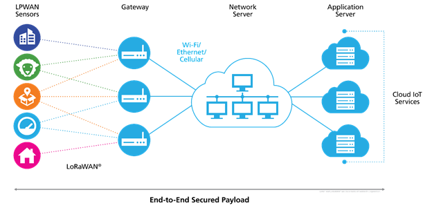
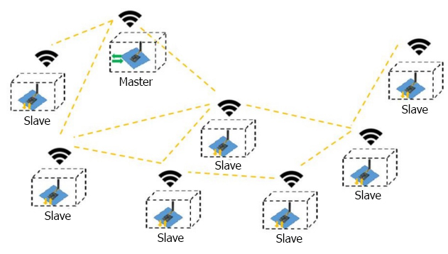
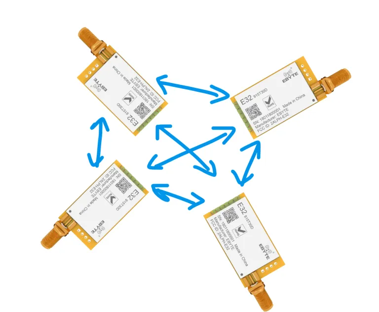
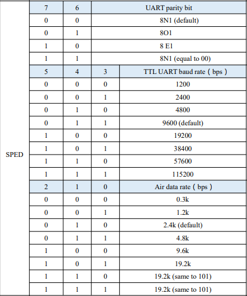
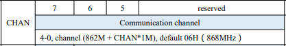
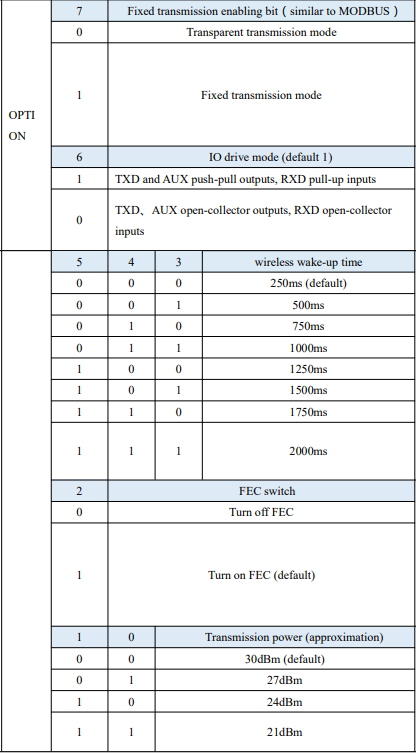

# LoRa 

## O que é?

Lora vem das palavras Long Range e é uma modulação de rede, que 
oference um longo alcance com baixa potência, ela deriva da tecnologia
chip spread spectrum(CSS).

Por possuir um baixo consumo para uma grande imunidade à ruídos variados,
além de possuir um alcance alto, é ideal para diversas aplicações IOT.

## LoRaWan

Uma das variações mais conhecidas e usadas em IOT é o LoRaWan, que atua 
com inúmeros dispositivos que se comunicam com o gateway e este faz o 
interfaceamento com a internet, podendo enviar dados em MQTT por exemplo.  

  
[Fonte](https://tech-journal.semtech.com/expert-series-5-things-you-need-to-know-about-lorawan-based-gateways)

## LoRa Mesh

Outro protocolo que é usado em IOT porém bem menos, é o LoRa Mesh, que 
atua em uma estrutura de malha, em que cada dispositivo pode atuar como 
um repetidor, aumentando o alcance da rede. É ideal quando precisamos de uma
área maior, e os dispositivos se comunicam muito entre si e não com um servidor
na nuvem.

  
[Fonte](https://github.com/elcereza/LoRaMESH)

## Transceptores LoRa

Existem diversos chips que fazer a comunicação via LoRa, porém o
mais comum é o SX12xx e sua comunicação é via SPI.  

Porém dependendo do projeto às vezes é interessante utilizar outros 
tipos de comunicação, pois SPI à depender do projeto pode ser u pouco 
mais trabalhoso de utilizar.  

Pos isso optamos por um transceptor relativamente mais simples de utilizar 
que é o da Ebyte, eles facilitam todo o trabalho que teríamos para configurar 
e estabelecer uma conexão, reduzindo o grau de dificuldade saindo do SPI 
para o UART.  

E com apenas 3 pinos, 2 de entrada e um de saída, é possível configura-lo 
e utiliza-lo. Mas por outro lado você não terá todas as liberdades que teria 
usando o módulo puro com o chip SX12xx.

## Comunicação do LoRa Ebyte 

A comunicação é feita utilizando indentificadores que são salvos de maneira 
volátil ou permanente, podendo assim realizar comunicações com módulos de mesmo 
ID ou receber e enviar para módulos de um ID específico.  

Caso o indentificador que está na mensagem seja diferente do que está salvo no 
registrador, o módulo apenas ignora a mensagem, uma operação relativamente simples 
que se fosse no chip padrão, teria que estruturar do zero.  

Os módulos da Ebyte são destinados à se comunicar de forma P2P, ou seja cada 
dispositivo pode atuar de forma independente, de maneira que não há necessidade de haver 
um dispositivo central que gerencie tudo.

  
[Fonte](https://elcereza.com/lora-da-ebyte-um-dos-mais-faceis-de-usar-do-mercado/)

## Características dos módulos Ebyte 

### Ebyte LoRa Pinout

O módulo possui entre 10 e 11 pinos sendo que os principais são 7.

1. M0 - Input - Determina junto com o M1 os modos de operação ( 2 bits - 4 modos )
2. M1 - Input - Determina junto com o M0 os modos de operação ( 2 bits - 4 modos )
3. RXD - Input - É a entrada da UART do módulo
4. TXD - Output - É a saída da UART do módulo
5. AUX - Output - É o status de operação do módulo, pode ser usado para iterrupções
6. VCC - Input - Tensão de trabalho de 3v3 ~ 5v5 DC
7. GND - Input - Terra 
8. -
9. -
10. -
11. -

### - Pino Auxiliar

O pino AUX serve para dar um feedback para o MCU, com ele podemos saber se o módulo
está iniciando, recebendo dados e se está ocupado. Toda vez que o pino estiver 
em nível lógico 0, devemos esperar a borda de subida, para assim, realizar o 
que desejámos.  

O pino AUX possui um resistor PullUp interno que eleva-o a 3v3, se o MCU não 
reconhecer 3v3 como nível lógico alto será necessário um utilizar um resistor 
de PullUp externo tanto no AUX como no TXD.

### - Inicialização do módulo

Durante o processo de Inicialização o pino AUX fica em nível lógico 0 por um 
curto período de tempo. Por isso é interessante o MCU esperar o pino ir para 
nível lógico alto, assim terá certeza que o módulo já está funcional.

### - Transmissão 

Quando estiver enviando dados é necessário verificar se pode ou não, o AUX 
se torna uma espécie de flag que diz quando pode ( AUX = 1 ) ou não ( AUX = 0 )
enviar novos bytes.  

### - Recepção 

Quando o módulo recebe um dado, ele avisa 2ms antes de transmitir baixando o AUX 
para nível lógico 0, assim preparando o MCU para receber os dados. Dessa forma 
devemos utilizar as interrupções para tirar o melhor proveito desse recurso.  

### - Configuração 

Para definirmos os modos de operação do módulo devemos utilizar os pinos M0 e M1,
com eles podemos ativar 4 modos de diferentes, sendo eles: 

| Modos | M1 | M0 | Descrição |
| --- | --- | --- | --- | 
| Normal | 0 | 0 | UART e o canais(wireless) estão disponíveis e a transmissão transparente está ativada. |
| Wake Up | 0 | 1 | É como o modo normal, porém antes de transmitir o dado, ele adiciona o o código de Wake Up, assim acorda o receptor que esteja em Sleep. | 
| Power Saving | 1 | 0 | UART é desabilitada e quando recebe um dado, reativa a UART, envia e desabilitada novamente. |
| Sleep | 1 | 1 | É o modo de Sleep, precisa ser despertado "antes" de receber o dado. | 

#### Obs:.

No modo Power Saving e Sleep, não é possível enviar dados.

## Programação do LoRa Ebyte 

Para programar é necessário que este esteja em Sleep, pois assim o chip LoRa estará desativado e 
apenas o MCU do módulo estará trabalhando, sendo assim, possível enviar dados para configurar 
via serial com um baudrate obrigatório de 9600. São enviados 6 bytes, contendo os seguintes 
parâmetros.

### - Head 

O primeiro byte será o Head, aqui podemos informar se iremos salvar os dados 
de maneira temporárea `0xC2`, ou seja, se acabar a fonte de alimentação, ou 
resetarmos o módulo ele irá perder toda a configuração, mas se informarmos 
`0XC0` todos os dados serão salvos permanente.

- 0xC0 - Permanentemente 
- 0xC2 - Temporareamente

### - Adress

Os próximos 2 bytes são os de endereçamento, o módulo suporta um endereçamento de 16 bits,
portanto devemos mandar o nosso endereço em 2 bytes, sendo o primeiro o mais significativo e 
depois o menos significativo.

### - Speed 

O quarto byte será a definição do baudrate da UART e o Air data rate, além do uso 
ou não de bits de paridade.

  

### - Channel 

O quinto byte será a definição dos canais, que irá definir a faixa em os dispositivo 
irão se comunicar, ou seja, ambos devem estar no mesmo canal. No datasheet nos fala 
quantos canais são disponíveis para cada módulo. No caso o datasheet no qual esse guia 
foi baseado é o do E32915T30D, no qual possui 32 canais de 0 - 31.

### - Options

O sexto e último byte é para configurações mais específicas. Nele 
podemos definir os seguintes parâmetros.

  

No `bit 7`, podemos definir para transmissão fixa ( bit 7 = 1 ), nela os 3 primeiros 
bytes do frame que será enviado, serão um endereço e canal. O módulo mudará 
seu endereço e canal quando for transmitir. E será revertido para a configuração 
padrão quando o processo acabar.  

No `bit 6`, podemos deixar as IOs em aberto, por padrão (bit 6 = 1) os resistores de 
PullUp internos estão ligados.

Nos `bits 5 - 3`, são definidos os tempos em que o módulo ficará ligado após ser despertado, 
por padrão é 0, ou seja 250ms.

No `bit 2` será definido se iremos utilizar ou não o FEC, que é um sistema de controle de 
erros que trata a informação recebida e tenta corrigir erros que possam ter acontecido.

Nos `bits 1 e 0` definimos a potência da transmissão.

## Comandos complementares

Há mais 3 comandos complementares que são ler os parâmetros de configuração, 
versão do módulo e Reset.

### Leitura de parâmetros 

Escrevendo `0xC1` 3 vezes no modo Sleep, o MCU irá retornar via UART os 6 bytes de 
configuração.

### Versão do módulo

Escrevendo `0xC3` 3 vezes no modo Sleep, o MCU irá retornar via UART de 4 à 8 bytes dependendo 
do módulo, informando Características do módulo, como frequência, versão, recursos e etc.

### Resetar configurações de fábrica 

Apenas escrever `0xC4` 3 vezes no modo Sleep.

