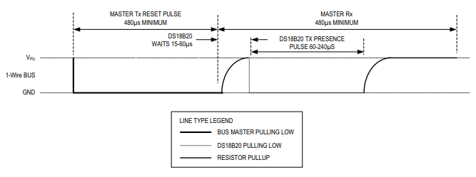
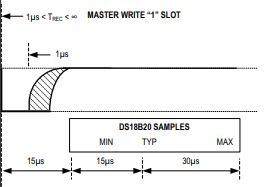
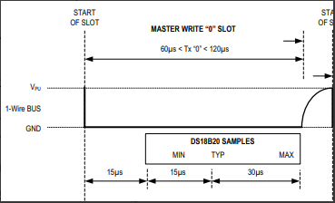

# Sensor de Temperatura

## Sensor ds18b20

O sensor ds18b20 é um módulo OneWire que fornece medições de temperatura
com precisão de 9-bit à 12-bit, além de ter função de alarme e suporte
a programação de usuário não volátil caso seja necessário.

## Como usar 

Podemos usá-lo utilizando bibliotecas disponibilizadas na arduíno IDE e
github, ou podemos implementar o código. Para utilizar a biblioteca é 
relativamente simples e em anexo haverá o código que a utiliza. 

### Pinagem

- VCC -> 3v3 à 5v
- GND -> GND
- Data -> Modo one wire(precisa de um pullup)

## Implementando na mão

Devemos seguir 3 passos básicos.

- Inicializar
- Configurar
- Ler

### Como iniciar o sensor

Nós devemos inicializar ele toda vez que formos configurar, pedir para converter 
e ler. De acordo com o datasheet devemos baixar o pino para LOW por 480us,
e depois esperar 80us e verificar se o pino está em LOW, se estiver
o sensor foi inicializado com sucesso.  

### Configurar o sensor

Para escrevermos um bit de valor 1, precisamos puxar a linha para LOW por 
15us.
  

Para escrevermos um bit de valor 0, precisamos puxar a linha por no mínimo 
60us.
  

Escrevendo de bit em bit podemos:
- Configurar o sensor
- Pedir para converter

Existe diversas configurações no datasheet mas a que utilizaremos é apenas, 
`0xCC` para não utilizarmos a ROM.  

### Lendo o valor convertido 

A operação de leitura é inicializada ao puxar a linha para LOW por no mínimo 1us 
e menos que 15us.
  

Depois se a linha continuar em LOW é porque o valor lido foi 0, porém se a linha 
voltar para HIGH, é porque o valor é 1.  

Isso deve ser repetido por 8 vezes para leitura de um byte.    

Obs: Devemos ler dois bytes. 

### Processo completo

- Iniciamos o sensor e esperamos 1us para estabilizar
- Configuramos com (0xCC) para pular a ROM 
- Pedimos para converter escrevendo (0x44)
- Esperamos a conversão, 800ms
- Iniciamos o sensor novamente e esperamos estabilizar 
- Configuramos com (0xCC) para pular a ROM 
- Configuramos com (0xBE) para a leitura 
- Lemos dois bytes, que é o valor da conversão. 

