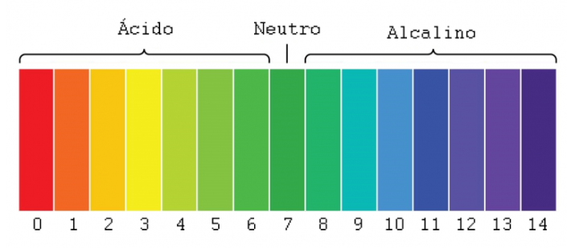

# Sensor de PH

## O que é?

O pH é a medida que infentifica de forma quantitativa, a alcalinidade ou 
acidez de uma solução, ou seja, o pH mede a quantidade de íons de hidrogênio
contidos na solução.  
Um pH de valor 7 é considerado neutro, valores de 0 a 6 são considerados ácidos
e de 8 a 14 alcalinos.

## Índice de pH 

  
[Fonte](https://www.usinainfo.com.br/blog/sensor-de-ph-arduino-como-calibrar-e-configurar/)

## Módulo ph-4502c

O sensor pode operar na faixa de 3v3 à 5v, e por se tratar de um dispositivo
que trabalha com valores de variação muito baixos, é necessário uma boa calibração.  
A placa além de medir o pH também possui um sensor de temperatura.

### Pinagem

- TO –> Temperature output
- DO –> 3.3V Output (from ph limit pot)
- PO –> PH analog output 
- Gnd –> Gnd for PH probe (can come from Arduino GND pin) 
- Gnd –> Gnd for board (can also come from Arduino GND pin) 

### Calibrando o sensor 

Nós queremos que a placa varie de 0pH - 14pH na faixa de 0v - 5v(ou algo parecido), porém 
por padrão a placa vem com o 7pH em 0v(ou próximo a isso).  
Para calibrar é necessário retirar a sonda e fazer um curto entre o centro da entrada da sonda, e 
a borda, forçando assim um 7pH fictício. Assim devemos ajustar o trinpot perto do conector, para
que na saída analógica tenha 2v5 que é metade de 5v(valor máximo).

### Saída D0

A saída D0 serve de gatilho para interrupções ou desvios de fluxo, ele fica em nível lógico
alto 3v3 enquanto a tensão(pH) estiver abaixo do limite, o limite é configurado no trinpot 
mais próximo aos pinos.

## Como utilizar

Para utilizar devemos medir a tensão, é interessante utilizar a media de varias amostras para desconsiderar 
possíveis ruídos.  

Depois usamos a seguinte fórmula `phValue = -5.70 * pHVoltage + calibration`.  
Onde o "calibration" é o valor que deve ser calibrado usando uma solução que já esteja definida
seu pH. Assim podemos aumentar ou reduzir o valor para que o pH bata com o da solução.

