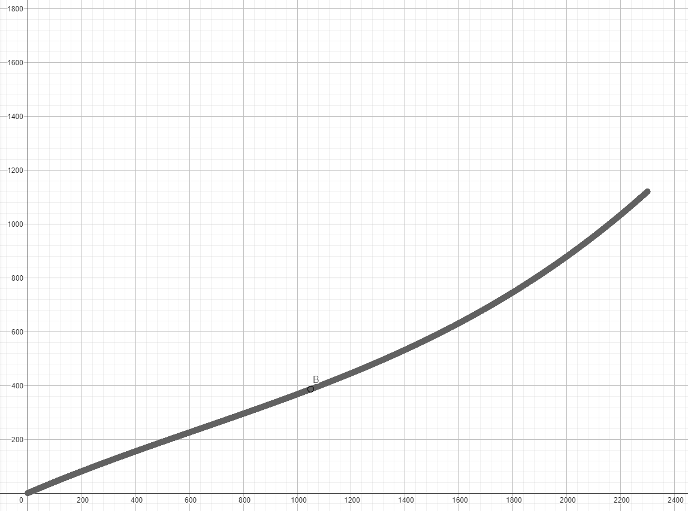

# Sensor de Condutividade ou TDS

## O que é?

O sensor de TDS ou Total Dissolved Solids fornece a soma dos sólidos dissolvidos em uma solução. 
Os sólidos incluem, por exemplo, sais, minerais e metais. Eles podem ser substâncias 
orgânicas ou inorgânicas. Algumas dessas partículas em solução carregam uma carga elétrica.
O valor também é chamado de condutividade da água. Porque quanto mais esses sólidos ou íons estão na água,
melhor conduz a eletricidade.  O medidor TDS normalmente quantifica essa condutividade em microsiemens ou ppm.  
[Fonte](https://hipperquimica.com.br/medidor-tds/)

## Níveis de TDS 

Nível de TDS(ppm) | Classifiação da água 
------------------ | ----------------
 Menos de 300 | Excelente
 300 à 600 | Bom 
 600 à 900 | Aceitável 
 900 à 1200 | Ruim 
 Mais de 1200 | Inaceitável

## Módulo: TDS Meter v1.0

O módulo trabalha de 3v3 ~ 5v5 DC, porém seu sinal de saída é de 0v à 2v3 e consome 
uma corrente de 3mA ~ 6mA. Sua faixa de medição  vai de 0ppm ~ 1000ppm, então pode
indentificar uma água no máximo ruim. 

Ele não é Linear e pode váriar em relação a temperatura, por isso é interessante 
usar em conjunto com ele um sensor de temperatura.

### Curva

### Como utilizar 

Para utilizar devemos medir a tensão, é interessante utilizar a mediana de varias amostras
para desconsiderar valores muito altos e baixos provenientes de ruídos ou erros de aferição.

Depois devemos de alguma forma compensar a variação de temperatura, o fabricante disponibiliza
a seguinte fórmula: `compensacao = (1.0+0.02*(temperatura-25.0))`. Depois é só dividirmos a 
tensão aferida pela compensacao: `tensao_c = tensao_med / compensacao`.

Assim podemos calcular o valor TDS, porém o valor não é linear e para medir de forma correta deve-se
usar a fórmula que o fabricante disponibiliza.  

`tds = (133.42*tensao_c*tensao_c*tensao_c - 255.86*tensao_c*tensao_c + 857.39*tensao_c) * 0.5`

