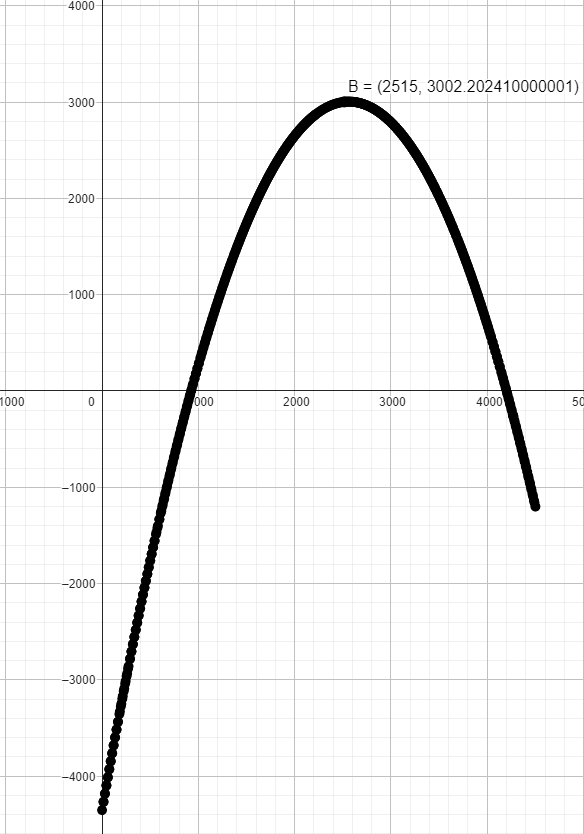

# Sensor de Turbidez

## O que é?

A turbidez é uma propriedade física que indica a existência de materiais em suspensão que 
reduzem a transparência e interferem a passagem de luz através de um determinado fluido.
A unidade de medida é NTU (Nephelometric Turbidity Unit) 
[Fonte](https://www.blogdarobotica.com/2023/01/10/como-utilizar-o-modulo-sensor-de-turbidez-de-particulas-suspensas-na-agua-com-arduino/)

## Módulo ST100

O funcionamento do sensor se baseia na emissão de feixes de luz. Quando a luz emitida se 
choca com alguma partícula ou sólido tem-se a dispersão do feixe de luz. Desse modo, em 
fluídos com mais sujeira temos maior dispersão e maior é a turbidez.
[Fonte](https://www.blogdarobotica.com/2023/01/10/como-utilizar-o-modulo-sensor-de-turbidez-de-particulas-suspensas-na-agua-com-arduino/)

## Funcionamento

O sensor pode funcionar de forma digital ou analógica e possui um trinpote para regulagem caso seja 
necessário. A saída é determinada por ligar os pads com solda, se ligar o do meio com o pad 'A' será 
analógica, mas se for o do meio com o pad 'D' será digital.

O sensor é alimentado com 5v, porém sua saída vai de 0v ~ 4v5, utilizando uma curva que será mostrada 
a seguir.

### Curva

## Fórmulas

O calculo para NTU é `ntu = -1120.4*tensao*tensao + 5742.3*tensao - 4352.9`

